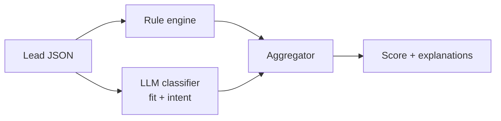

# ai-lead-scoring

A hybrid lead-scoring engine. Deterministic YAML rules handle the things that should never be ambiguous ("is the company between 200 and 5,000 employees? +20"), and a Claude-powered classifier handles the things that genuinely require judgment ("does the prospect's recent blog post or job opening signal that they're actively shopping for what we sell?"). Every score comes back with a per-signal breakdown so RevOps can audit it and reps can use it to prioritize.

## The GTM problem this solves

Most lead scoring lives in marketing automation as a flat point system that nobody can audit and that drifts wildly from sales reality. The opposite extreme — "let an LLM read the lead and give it a number" — is unauditable and rate-limit-exposed. This project takes both halves seriously: rules for the cheap, fast, deterministic part; LLM only for the parts where it adds judgment that rules can't. The output is one number plus an explanation, and the explanation is the asset.

## Quick start

```bash
pip install -r requirements.txt
export ANTHROPIC_API_KEY=sk-...   # optional; without it, only rules fire
python -m scoring.cli score --input data/sample_leads.json --rules rules.yaml
```

Sample output:

```json
{
  "lead": "sara@notion.so",
  "score": 82,
  "tier": "A",
  "signals": [
    {"name": "company_size_fit", "weight": 20, "source": "rule", "reason": "800 employees in [200, 5000]"},
    {"name": "icp_industry", "weight": 15, "source": "rule", "reason": "industry='Productivity Software' in target list"},
    {"name": "seniority", "weight": 25, "source": "rule", "reason": "title contains 'Director' (decision-maker)"},
    {"name": "intent", "weight": 22, "source": "llm", "reason": "Recent job posting for 'Sales Engineer' indicates active GTM expansion"}
  ]
}
```

## How it works



The rule engine evaluates a YAML file you control — each rule has a name, a Python expression that returns a bool, a weight, and a reason template. The LLM classifier is asked two things only: a fit score (does this lead look like our customers?) and an intent score (do we have evidence they're actively in-market?). It must justify each in one sentence. The aggregator caps the total at 100 and assigns a tier.

## Why this design and not pure LLM

A pure-LLM scorer is non-deterministic and expensive at volume. A pure-rules scorer can't tell that a job posting for a Sales Engineer is bullish for your CRM product. The hybrid is what real GTM teams end up with anyway — this just makes the seam first-class instead of tribal knowledge.

See `rules.yaml` for the example rule set (industry list, employee bands, title heuristics, technology fit). Tests in `tests/` cover rule evaluation, LLM mocking, and aggregation cap behavior.

## License

MIT.
